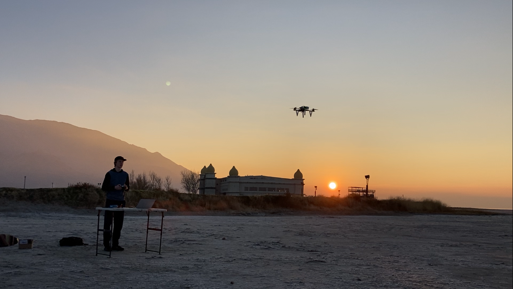

# Avy Dawgs Avalanche Search Drone Senior Capstone
Our goal is to create a drone that demonstrates autonomous 
location identification of avalanche beacon signals.
We aim to show that this technology can improve the current 
standard avalanche search and rescue procedure, potentially 
saving lives.

## Team Members 
#### Aidan Leary 
B.S. Computer Engineering student at the University of Utah. 
Avid skier that grew up ski racing in New Hampshire before moving to 
Utah for college and developing an interest in backcountry and big mountain 
skiing.

#### Hiram Perez 
B.S. Computer Engineering & Electrical Engineering at the University of Utah. No skiing/snowboarding 
experience, but interested in RF and circuit design. Utah native.
#### Dax Jennings 
B.S. Computer Engineering, University of Utah. Park/street skier that dabbles in backcountry skiing.

#### Noah Sikorski
B.S. Computer Engineering, Minor Physics at the University of Utah.

## Project Overview 
Our system consists of an autonomous drone, and a base station device (laptop or tablet) running ground control 
software.
The user of the system will use the ground control software to configure a search area and launch the drone.
Upon launch, the drone will autonomously scan the search area, sending RSSI readings back to the base station, which 
will create a heatmap on the ground control software's map. 
The drone will also determine the victim locations algorithmically, sending estimated victim coordinates 
back to the base station.

### Motivation
Our motivation is to save the lives of skiers who get caught in the unfortunate event of a avalanche.
Data shows that more than 150 people avalanche deaths per year worldwide, with the average survival rating 
being 92% if the victim is found within 15 minutes; and around 30% after fast search means greater probability 
of survival

### Physical Description
The system is divided into two main subsystems: the drone, and the base station. 
The base station subsystem consists of a laptop or tablet running ground control software and a telemetry 
radio to communicate with the drone. 
The drone subsystem consists of the drone itself, a companion computer, (Raspberry Pi Zero 2 W) and our 
custom receiver.

#### Physical Diagram

### Functional Description
The base station is the end user interface, providing the ability to configure and 
launch the drone, as well as the ability to display the locations of discovered victims. 
The other important piece of the functional system is the companion computer. 
This computer is the central brain of the system, interpreting signal strength data coming from the receiver 
along with location data coming from the drone's flight controller, in order to find the locations of buried victims.

## Current Progress 
We have demonstrated the ability to measure a WiFi signal from a mobile hotspot and find its location using the drone. 
Due to time constraints, we decided to implement this backup plan so that we have a working demonstration 
before we move onto testing and integrating our custom receiver. 
This being said, our ultimate goal is still to have the custom receiver in the final system.

### Initial Integration Tests
The following videos are from our first test with the companion computer integrated onto the drone.

https://github.com/user-attachments/assets/d52003d5-fc5f-4227-8c83-529ad4e05b48

https://github.com/user-attachments/assets/4c8f8e11-eded-4c3d-afc4-6c99249d23f9

<!-- comment out images -->
<!--  -->
<!--  -->

### Receiver
The receiver has been mostly assembled, but we still have to finish up the
FPGA firmware development before it can be tested.

## Design File Repositories 
* [System Definition](https://github.com/Avy-Dawgs/system-definition)
### Drone Subsystem
* [Drone Wiring Diagram](https://github.com/Avy-Dawgs/wiring-diagram)
* Receiver
    * [PCBs](https://github.com/Avy-Dawgs/receiver-pcb)
    * [FPGA Firmware](https://github.com/Avy-Dawgs/receiver-fpga) 
* Companion Computer 
    * [Signal Location Software](https://github.com/Avy-Dawgs/Signal-Map)

### Base Station Subsystem
* [Custom QGroundControl](https://github.com/Avy-Dawgs/QGroundControl-Custom-Base-Station)
